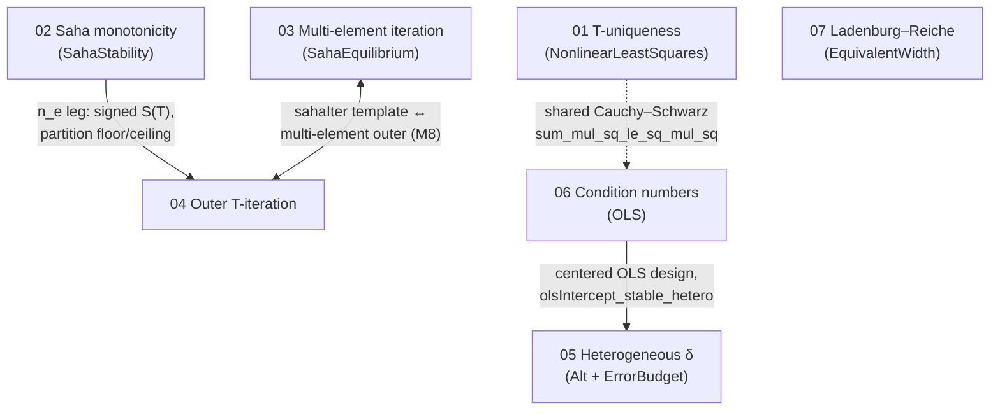

# Frontiers ROADMAP — master plan across the seven hard-frontier dossiers

*Synthesis of `docs/frontiers/01..07`. Every claim is traceable to a dossier (cited by file + section).
Scope tags use the repo vocabulary: PURE-MATH / EXACT / REDUCED / APPROXIMATION.*

---

## 1. Executive summary (one paragraph per frontier)

- **01 — T-direction uniqueness of the (T,N) fit** (`01-t-uniqueness.md`). *Obstacle:* no theorem that the
  profiled objective `Φ(T)` has a unique T-minimizer; `nlObjective` is non-convex in T through `exp(−E/kT)`
  and `U(T)` (§1). *Route:* the partition function `U(T)` **provably cancels** from the profiled Rayleigh
  quotient (§2.1), and for two lines `Φ₂(T)=(obs₁−obs₀·t)²/(1+t²)` with `t(T)` strictly monotone under
  distinct energies (§2.2). *First milestone (A):* two-line closed form + on-manifold `Φ₂=0 ⟺ T=T0`. *Tractable:*
  yes — pure `ring` + `Real.exp_lt_exp`, no new mathlib (§3).

- **02 — Saha-factor monotonicity in T** (`02-saha-monotonicity.md`). *Obstacle:* no signed statement; `dS/dT`
  is sign-indefinite through the partition ratio `U₁/U₀` (§1). *Route:* derivative-free termwise proof over
  the already-proven `log_sahaFactor`, taming the ratio by pairing `U₀`'s growth against `exp(−χ/kT)` (§2.2).
  *First milestone (A):* `partitionFunction_upper_growth`, the crux termwise bound (§4 M2). *Tractable:* yes —
  zero new mathlib, all lemmas grepped present (§3); headline `sahaFactor_strictMonoOn_temp` is then bookkeeping.

- **03 — Multi-element iteration convergence** (`03-multi-element-iteration.md`). *Obstacle:* `x_{n+1}=G(x_n)`
  never shown to converge; `G` is antitone so it oscillates, and there is no √-reformulation as in the scalar
  leg (§1). *Route:* exact two-point/Lipschitz identity (§2 I), a damped Krasnoselskii–Mann map giving an
  **unconditional** contraction (§2 b), and — the crown — `G∘G` monotone + a no-2-cycle lemma proving the
  literal direct iteration converges (§2 c). *First milestone (A):* `multiElementIonized_two_point` + Lipschitz
  (§4 M1). *Tractable:* yes for M1–M7; only Newton (M8) needs absent convexity infra (§3).

- **04 — Outer T-iteration of the full loop** (`04-outer-t-iteration.md`). *Obstacle:* no self-map `Φ` on T
  whose fixed point is the CF-LIBS solution; all sensitivity constants exist but nothing composes them (§1).
  *Route:* abstract two-leg box contraction (`legT ∘ legNe`, product constant `<1`), instantiated by the
  **combined Saha–Boltzmann slope** (Model B) which is the only non-degenerate loop (§2). *First milestone (A):*
  `outerContraction_box`, the abstract spine (§4 M1). *Tractable:* spine is A; the headline rests on one genuinely
  new def `combinedSahaBoltzmannSlope` + its offset→slope sensitivity (M4, grade B) — all mathlib present (§3).

- **05 — Per-line heterogeneous δ in the OLS aliasing channel** (`05-heterogeneous-delta.md`). *Obstacle:* the
  multi-line OLS density reader × atomic-data-error cell is empty; no `olsDensity_aliasing` (§1). *Route:* a
  per-line atomic-data error is *exactly* an additive ordinate error `δ_k`; OLS carries the **geometric mean**
  (log-domain average) of the data ratios as an exact identity (§2). *First milestone (B):* `olsDensity_aliasing_A`
  (EXACT), the OLS mirror of `classicDensity_aliasing` (§4 M2); grade-A prerequisites `olsIntercept_stable_hetero`
  (M0) and `abs_log_ratio_le` (M1) are quick wins. *Tractable:* yes — reuses `relDensity_le` / `abs_exp_sub_one_le`
  verbatim (§3).

- **06 — Quantitative condition numbers** (`06-condition-numbers.md`). *Obstacle:* only the binary rank gate
  `det≠0`; no condition number or perturbation bound (§1). *Route:* centering makes the two design columns
  orthogonal, so the centered normal matrix is **diagonal** `diag(SS_E, n)` — eigenvalues for free, no spectral
  stack (§2). *First milestone (A):* `centeredDesignNormalMatrix_eq_diagonal` (§4 M1). *Tractable:* yes — only
  `Fin 2` det/adjugate/diagonal lemmas; but honest framing (M6: scaled design ⇒ κ=1) required, as κ mostly
  repackages existing noise gains (§5).

- **07 — Ladenburg–Reiche sharp constant** (`07-ladenburg-reiche.md`). *Obstacle:* a factor-≈18 two-sided `√τ`
  envelope, no sharp asymptotic equality `W(τ)/√τ → 2` (§1). *Route:* bessel-free DCT after the rescaling
  `x=√(τ/π)u`; the limit integral `∫(1−e^{−1/u²})=2√π` fixes `C=2`, derived twice (§2). *First milestone (A):*
  `equivWidth_lorentzian_scaled`, the scaling identity (§4 M1). *Tractable:* yes — every lemma present in
  v4.31.0 (§3); the full L–R *function* (needs Bessel `I₀,I₁`, ABSENT) is explicitly out of scope (§2 c).

---

## 2. Cross-frontier dependency graph

- **02 → 04.** The outer loop's `legNe` is `electronDensityFromRatio = S(T)/R`; its interval invariance (M2
  `neLeg_mapsTo`) uses the partition floor/ceiling bounds in `SahaStability.lean`, and 02's signed monotonicity
  (`sahaFactor_strictMonoOn_temp`, 02 §4 M4/M5) upgrades those legs from a two-sided Lipschitz bound to signed
  behaviour (`04-outer-t-iteration.md` §1, §3; `02-saha-monotonicity.md` §2.5).
- **03 ↔ 04.** Both hand-roll the same `sahaIter` contraction ladder as their template (`04` §1, `03` §1); and
  04's deferred Model C / multi-element outer (04 §4 M8) *compounds* the still-open multi-element `n_e`-iteration
  convergence that 03 closes (04 §5, 03 §4 M5/M7). Bidirectional: 04 supplies the abstract spine, 03 supplies the
  inner multi-element convergence 04's M8 consumes.
- **06 → 05.** Both live over the **centered** OLS design (`mean E = 0`). 05's grade-A prerequisite
  `olsIntercept_stable_hetero` (05 §4 M0) and 06's per-channel bound (06 §4 M4) both build on
  `olsIntercept_stable_centered` (`ErrorBudget.lean:297`); the centered-design orthogonality that 06 §2 exploits
  is the same normalization 05 §2 assumes (`05` §5, `06` §2).
- **01 ⇢ 06 (weak).** Shared only through mathlib `sum_mul_sq_le_sq_mul_sq` (Cauchy–Schwarz), used by 01 §3 for
  `Φ≥0` and by 06 §3 already in `ErrorBudget.lean:115`. No logical dependency.
- **07** is standalone (`EquivalentWidth.lean`); no cross-frontier edges.

---

## 3. Shared infrastructure (ABSENT-from-mathlib items, collected)

**Local candidates (build in-repo; needed for Phase 1/2):**
- `olsIntercept_stable_hetero` — per-line intercept-stability twin of `olsSlope_stable_hetero`; **shared by 05
  and 06**. → `ErrorBudget.lean` (`05` §4 M0; `06` §4 M4 relies on the same centered intercept gain).
- `abs_log_ratio_le` : `|log(a/a')| ≤ δ/(1−δ)` — two-sided log-transfer, 4-line derivation from the one-sided
  `Real.log_le_sub_one_of_pos`. → `Analysis.lean`/`ErrorBudget.lean` (`05` §3).
- Even/odd → full `Tendsto` interleave — no single mathlib lemma; hand-roll ~10–15 lines via
  `Metric.tendsto_atTop` + `Nat.even_or_odd`. → local, `SahaEquilibrium.lean` (`03` §3, M7).
- Lagrange identity `‖d‖²‖obs‖² − ⟨d,obs⟩² = ∑_{i<j}(d_i obs_j − d_j obs_i)²` — avoids the `EuclideanSpace`
  bridge for general-m. → private, `NonlinearLeastSquares.lean` (`01` §3, M3).
- `boltzmannConditionNumber` def + `Matrix.conditionNumber` — no mathlib condition number exists; define our
  own via the diagonal form. → `OLS.lean` (`06` §3).
- Promote private `partitionFunction_ge_floor`, `thermalBracket_mono` to public `partitionFunction_mono_temp` /
  `thermalBracket_strictMono`, or keep new work in `SahaStability.lean`. → local (`02` §3, §4 M1/M3).

**Genuine upstream-mathlib projects (only block DEFERRED/REFUSED targets — do NOT gate Phase 1/2 on them):**
- Modified Bessel `I₀, I₁` — ABSENT; XL upstream; needed only for the *full* L–R function, which the sharp-constant
  route deliberately avoids (`07` §2 c, §3). **Refused target, not a blocker.**
- Concave-Newton / convexity of `x↦(x+S)⁻¹` — ABSENT (`convexOn_rpow` needs `p≥1`); only for 03's Newton rate
  (M8) (`03` §3). **Deferred.**
- Strict equality condition for `sum_mul_sq_le_sq_mul_sq`, and a closed-form `2×2` eigenvalue lemma — both ABSENT
  but **avoidable** (01 uses the elementary Lagrange identity; 06 reads eigenvalues off the diagonal form)
  (`01` §3, `06` §3). Not on any critical path.

---

## 4. Phased execution plan (ordered by value × tractability)

### Phase 1 — tractability-A quick wins (no unmet deps, mostly PURE-MATH)
| Frontier | Deliverable theorem(s) | Target module | Scope tag |
|---|---|---|---|
| 01 M1–M6 ✅ | On-manifold (M1–M3): `profiledResidual_two_closed_form` + `profiledT_onManifold_unique` (general-`m`, two-line a corollary) + `joint_onManifold_unique` (full `(T,N)` argmin). Off-manifold (M4–M6): `profiledT_two_offManifold_unique` (M5 — at most one exactly-fitting `T`, `obs` arbitrary) + `profiledResidual_stability_in_obs`/`profiledResidual_nearManifold_bound` (M4 — near-manifold `L²` stability, the *value* half; argmin-uniqueness under noise stays open) + `profiledResidual_not_injective_m3` (M6 — honest negative: explicit 3-line `Φ(1)=Φ(2)=19` counterexample, off-manifold `T`-uniqueness FALSE for `m≥3`) — **DONE** (`NonlinearLeastSquares.lean`; exact-fit route, no `∑_{i<j}` Lagrange machinery needed) | `NonlinearLeastSquares.lean` | PURE-MATH + EXACT + REDUCED |
| 02 M2 | `partitionFunction_upper_growth` (crux termwise bound) — with A-siblings M1 `thermalBracket_strictMono`, M3 `partitionFunction_mono_temp` | `SahaStability.lean` | PURE-MATH |
| 03 M1 | `multiElementIonized_two_point` + `multiElementIonized_lipschitz` | `SahaEquilibrium.lean` | PURE-MATH |
| 04 M1 | `outerContraction_box` (abstract two-leg box contraction spine) | `SahaEquilibrium.lean` (new block) | REDUCED |
| 05 M0+M1 | `olsIntercept_stable_hetero`; `abs_log_ratio_le` (shared infra, unlock 05/06) | `ErrorBudget.lean` / `Analysis.lean` | PURE-MATH |
| 06 M1 | `centeredDesignNormalMatrix_eq_diagonal` (keystone) | `OLS.lean` | PURE-MATH |
| 07 M1 | `equivWidth_lorentzian_scaled` (scaling identity) | `EquivalentWidth.lean` | EXACT |

### Phase 2 — B-grade, dependencies now satisfied
| Frontier | Deliverable theorem(s) | Target module | Scope tag |
|---|---|---|---|
| 02 M4/M5 | `sahaFactor_strictMonoOn_temp` (headline) → `electronDensityFromRatio_strictMonoOn_temp` | `SahaStability.lean` | EXACT |
| 05 M2→M4 | `olsDensity_aliasing_A` (EXACT anchor) → `_error` (REDUCED) → `olsComposition_atomicData_error` | new `Alt/OLSAtomicDataPerturbation.lean` | EXACT / REDUCED |
| 03 M3→M7 | `dampedIter_*` unconditional convergence (headline); `multiElementIonized_no_two_cycle`; `multiElementIonized_iter_tendsto` (crown) | `SahaEquilibrium.lean` | REDUCED / PURE-MATH |
| 04 M2→M6 | `neLeg_mapsTo`, `LipschitzOnWith` package, **`combinedSahaBoltzmannSlope` + `combinedSlope_offset_lipschitz` (crux)**, `T`-leg, outer-loop-contracts headline | `SahaEquilibrium.lean` / `ErrorBudget.lean` | REDUCED |
| 06 M2→M6 | `det_centeredDesignNormalMatrix`, `boltzmannConditionNumber`(+`_ge_one`), `centeredSolve_perturbation`, `centeredSolve_relative_condition`, `centeredScaledDesign_orthonormal` | `OLS.lean` | PURE-MATH |
| 07 M2→M4 | `integral_one_sub_exp_neg_inv_sq = 2√π` (crux) → DCT convergence → `equivWidth_lorentzian_sqrt_sharp` | `EquivalentWidth.lean` | EXACT |
| 01 M2/M3/M5 | joint two-line on-manifold uniqueness; general-m on-manifold uniqueness; two-line off-manifold box uniqueness | `NonlinearLeastSquares.lean` | EXACT / REDUCED |

### Phase 3 — C-grade / upstream-blocked (defer)
| Frontier | Deliverable | Blocker | Scope |
|---|---|---|---|
| 01 M4 / M6 | near-manifold local uniqueness (B/C); m≥3 off-manifold **counterexample** | perturbation vs calculus route; positive theorem refused (§5) | REDUCED / EXACT |
| 04 M8 | joint `(T,n_e)` 2-D map + multi-element outer | needs 03's crown convergence; product-metric | REDUCED |
| 05 M6 | E-channel (`E'≠E`) aliasing | wrong-abscissa residual; no repo analogue | REDUCED/APPROX |
| 06 M7 | multi-element Saha–Boltzmann joint design κ | no k-column design object; non-closed-form spectral κ | REDUCED |
| 03 M8 | Newton quadratic rate | concave-Newton convexity infra ABSENT | — |
| 07 (full) | full L–R function `x·e^{−x}(I₀+I₁)` | modified Bessel ABSENT (XL upstream) | — |

*Every new theorem requires a `docs/scope-tags.tsv` row or the docs-sync CI gate fails (repo memory; noted in
each dossier §4/§5).*

---

## 5. Refusals (recorded so future sessions do not re-litigate)

- **01 §2.5, §5 — global m≥3 off-manifold T-uniqueness is likely FALSE.** This is the classic multimodal
  exponential-fitting problem (Varah; Golub–Pereyra VARPRO); a general uniqueness theorem should not be attempted.
  The correct disposition is the M6 counterexample. Also: the **calculus route to unimodality is a trap** —
  differentiating through the Rayleigh quotient is far harder than the algebraic `(obs₁−obs₀t)²/(1+t²)` closed form.
- **02 §2.4, §4 M7 — Chebyshev/Monovary correlation route NOT needed** (the termwise proof sidesteps mean-energy
  comparison); the relaxed-hypothesis M7 is **not recommended** — M4's `∀k, E₀k ≤ χ` already holds for every real
  atom, so M7 buys generality that never binds.
- **03 §5 — plain direct contraction alone is insufficient** (`L(0)=∑Ntot/S < 1` is physically narrow; label any
  such result REDUCED-conditional). `G∘G` is **not** a global 2-step contraction in the multi-element case (the
  single-species cancellation fails) — do not attempt it; use the monotone even/odd subsequence argument. Newton
  (M8) deferred indefinitely.
- **04 §2, §5 — Model A (single-stage two-line temperature) is REFUTED as the loop target.** Because
  `temperature_from_two_lines` is composition-independent, that `Φ` is constant (`L=0`) and the headline would be
  *true but vacuous*. Only Model B (combined slope) has content. Do **not** start from mathlib's `ContractingWith`
  (edist tax); hand-roll the box contraction as the `sahaIter` block already does.
- **05 §5 — the aliasing bounds are worst-case BIAS, not variance.** Atomic-data errors are systematic; do **not**
  claim variance-reduction / "more lines ⇒ better" / a minimum-line-count — a uniformly-signed δ is not averaged
  away (`exp(mean δ)≠1` as `n→∞`). E-channel may be genuinely awkward (projection artifact), not merely hard.
- **06 §2, §5 — raw-matrix κ is REFUTED as the headline** (shift-non-invariant: `E↦E+c` changes it; mixed units).
  Use the centered/scaled form only. Be honest that κ for the 2-column design mostly repackages the existing
  `olsSlope_noise_gain` (`1/SS_E`) and `olsIntercept_stable_centered` (`1/n`) — lead with M6 (κ=1 after scaling).
  Do not reach for the spectral eigenvalue stack for a `2×2`.
- **07 §2 c, §5 — the full Ladenburg–Reiche function is REFUSED near-term.** `L(x)=x·e^{−x}(I₀(x)+I₁(x))` needs
  modified Bessel functions, ABSENT from mathlib v4.31.0 (an XL upstream build). The sharp *constant* (C=2) is
  reachable bessel-free via route (a); the *function* is not, and must not be attempted here.
