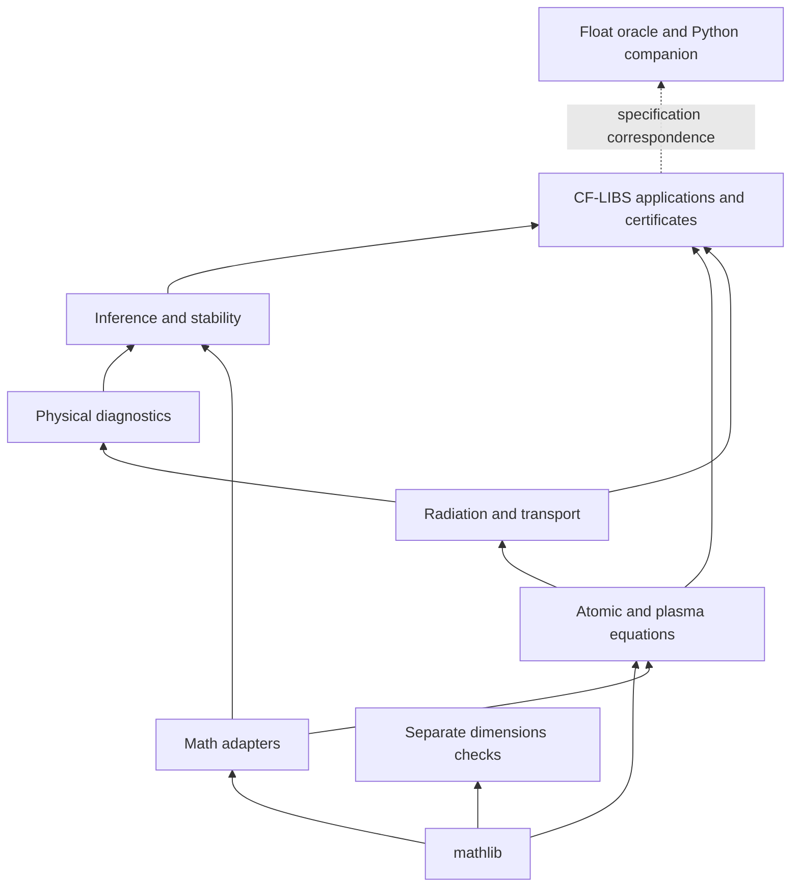

# 03 — Target architecture

[Plan index](README.md)

## Organizing principle

A physicist should start from a model's state, assumptions, governing equations, and observables;
a formalizer should then find the mathematical support and proofs. Folder names should follow
those responsibilities. Keep `CflibsFormal` as the package and current declaration namespaces
initially: moving files and renaming theorem constants are separate migrations.

The following paths are **proposed**, not existing APIs. Do not create empty scaffolding for all
of them before migrating a real vertical slice.

```text
CflibsFormal/
  Math/                   # Small adapters to mathlib; no plasma concepts
    Bounds/               # Exponential, reciprocal, finite-sum perturbations
    Regression/           # Deterministic finite-data OLS and conditioning
    FixedPoint/           # Reusable convergence adapters, only where necessary
    Composition/          # Closure and log-ratio geometry
  Physics/
    Atomic/               # Levels, weights, transition conventions, partitions
    Plasma/               # LTE populations, ionization, charge balance, reduced kinetics
    Radiation/            # Emissivity, opacity, profiles, transfer, continuum
    Diagnostics/          # Line ratios, Boltzmann slopes, Stark and opacity guards
    Dimensions/           # Independent homogeneity checks; no inverse-core dependency
  Inference/
    Identifiability/      # Recoverability and rank conditions for specified models
    Estimators/           # Classic and alternative estimators with explicit model choice
    Stability/            # Deterministic perturbation and composition bounds
    Statistics/           # Probability assumptions, variance, coverage
    Algorithms/           # Iteration/convergence of inference procedures
  Applications/
    CFLIBS/               # End-to-end conditional chains and certificates
    TimeResolved/         # Gate/spatial aggregation with explicit assumptions
    Correlation/          # Proven 2DCOS content; no unsound historical derivations
```

Retain `oracle/`, `tools/`, and `upstream/` outside the mathematical library. Research documents
and audit archives remain documentation, not imported theorem modules. External adapters, if ever
approved, belong to a separate target with an explicit dependency boundary.

## Dependency rules



An arrow means the upper consumer may depend on the lower provider. Dimensions may reuse scalar
formulas for an audit if the design calls for it; the inverse core must never depend on dimensional
types. An oracle comparison is a correspondence check, not a theorem dependency or proof extraction.

1. Physics must not import a CF-LIBS estimator or its runtime certificate wrapper.
2. Abstract analysis must not import atomic populations, measured spectra, or Python interfaces.
3. Model-specific convergence adapters can depend on physics; generic contraction facts cannot.
4. Statistics must expose the probability-space and noise hypotheses separately from deterministic
   finite-data algebra. Shared algebra belongs below both.
5. Different estimators share physical definitions; they do not copy Saha, emission, or closure.
6. The eventual topic aggregators should support a plasma/radiation reading path without pulling in
   `Alt.StochasticBudget`, conformal coverage, or application certificates.
7. During migration, legacy module paths are thin import shims. New modules never depend on shims.
   Keep an explicit removal condition; a permanent second implementation is not compatibility.

## A readable physical module

Each module should present, in order:

1. **Question and model:** e.g. ion-stage populations at fixed temperature and electron density.
2. **Variables and convention:** meaning, sign, dimension reference, indexing, finite truncation.
3. **Assumptions:** supplied laws, equilibrium/geometry reductions, valid domain, exclusions.
4. **Definitions:** one canonical equation for each concept.
5. **Physical properties:** positivity, conservation, normalization, monotonicity, limiting behavior.
6. **Diagnostic consequence:** what an observable identifies, and under which nondegeneracy condition.
7. **Witness and failure case:** jointly satisfiable hypotheses and an excluded degenerate example.
8. **Source and proof status:** verified equation location, existing scope tag, supplied versus derived.

Do not add a huge universal `PlasmaState` record carrying every optional effect. Start with ordinary
scalar arguments and narrowly scoped predicates; introduce a record only when repeated hypotheses
have stable meaning across real consumers. A physical-facing predicate can wrap existing `ℝ`
functions without changing the underlying dimensionless inverse model.

## Example vertical slice: finite-level LTE emission

| Responsibility | Existing material | Proposed result of reorganization |
|---|---|---|
| Populations | `Boltzmann` | Weighted finite partition and normalized population in Atomic/Plasma |
| Photon-like integrated observable | `ForwardMap` | Explicit instrument/Fcal convention in Radiation |
| Energy observable | `ForwardMapEnergy` | A separately named conversion with wavelength and geometry factors |
| Thermometry | `Identifiability`, `OLSIdentifiability`, `Classic` | Diagnostic assumptions before estimator implementation |
| Element composition | `Closure`, `Classic`, `SahaInverse` | Composition basis and ion-stage completeness made explicit |
| Application gate | `Certificates`, `EvaluatorSoundness` | A documented hypothesis ledger, downstream of all preceding layers |

Preserve all exported types and names through the first slice. The initial goal is that a reader
can follow this chain without opening optimizer, correlation, or statistics files.

## Documentation architecture

Make a short physics map the main entrance. Keep generated references exhaustive. Keep human
assumption ledgers separate from generated API catalogs. Give exploratory material clear labels:
current proposal, superseded model, known invalid derivation, or validated mathematical result.
A document's directory is not itself a correctness classification.

Avoid hand-updated theorem counts in several front pages. A source census is useful maintenance
metadata; progress should be reported as completed equation chains with explicit hypotheses.
